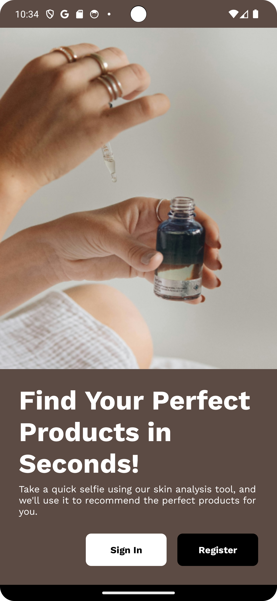

# DermAI Mobile App
## Description
**DermAI** is an Android application designed to provide personalized skincare recommendations through advanced image recognition technology. Using your device's camera, DermAI analyzes the skin profile of your face and suggests tailored skincare products to help you achieve healthier skin.
## Features
* **Skin Analysis:** Take a selfie or use a picture from your gallery to receive a personalized assessment of your skin profile.
* **Skincare Recommendations:** Find the perfect skincare product for your personal needs based on your skin analysis result.
* **Tap To Shop:** Simply tap on any product to see where you can purchase it online. Streamline your skincare shopping experience!
* **Wishlist:** Save your favorite skincare to make it easier for you to search and buy it next time.
## Getting Started
1. **Clone the repository:**
   ```bash
   git clone https://github.com/QaorVa/DermAI.git
2. **Open the project in Android Studio:**
   * Launch Android Studio.
   * Select Open an existing project.
   * Navigate to the cloned repository and select it.

3. **Build and Run the app:**
   * Connect your Android device or use an emulator.
   * Click Run to build and deploy the app.
## Screenshots
<p float="left">
  
  
  
  
  
  
  
  
</p>
